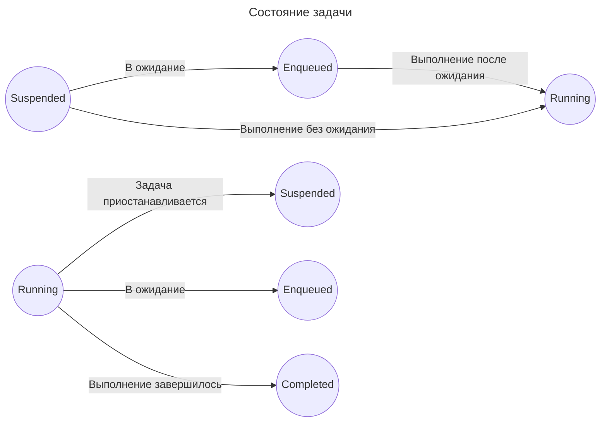

# Заглядываем внутрь Task

Для начала, каждая задача имеет четыре состояния. За состояние (статус) отвечает класс `TaskStatusRecord`:

1. Suspended: приостановлена и не выполняется
2. Enqueued: ожидает выполнения
3. Running: выполняется
4. Completed: выполнена

За переключение состояний отвечают четыре метода. Возможны следующие переходы из одного состояния в другое:

```swift
// suspended -> enqueued
// suspended -> running
// enqueued -> running
// running -> suspended
// running -> completed
// running -> enqueued
```

Схематично:



## Метаданные

Как понять, в каком состоянии задача приостановила свою работу ? А в каком должна возобновить ?
Для ответа на эти вопросы, существуют методы с помощью которых можно передать контекст для приостановления и возобновления задачи.

1. `AsyncContext`: данный контекст управляет состоянием задачи, которая ожидает завершения в дальнейшем. Когда задача приостанавливается, текущее состояние и контекст сохраняются, чтобы ее (задачу) можно было возобновить позже.
2. `Continuation` (TaskContinuationFunction): с помощью `continuation` возобновляется выполнение задачи.

```cpp
// Функция для возобновления выполнения AsyncTask.
TaskContinuationFunction * __ptrauth_swift_task_resume_function ResumeTask;
```

3. Класс `TaskOptionRecord` отвечает за запись параметров созданной задачи, включая приоритет и другие детали, помогающие исполнителю эффективно и корректно управлять задачами.
В обычном Swift хранится указатель метаданных и диспетчирезация происходит в witness table.
Во встроенном (embedded) Swift у нас отсутствует witness table в рантайме, поэтому диспетчеризация вызывается напрямую (direct).

<!-- /// Describes type information and offers value methods for an arbitrary concrete
/// type in a way that's compatible with regular Swift and embedded Swift. In
/// regular Swift, just holds a Metadata pointer and dispatches to the value
/// witness table. In embedded Swift, because we do not have any value witness
/// tables present at runtime, the witnesses are stored and referenced directly.
///
/// This structure is created from swift_task_create, where in regular Swift, the
/// compiler provides the Metadata pointer, and in embedded Swift, a
/// TaskOptionRecord is used to provide the witnesses. -->

## Планирование, приостановка и возобновление задачи

Исполнитель (executor) отвечает за планирование и запуск задач.
<!-- Executors: An executor is responsible for scheduling and running tasks. ExecutorRef manages references to executors, ensuring that tasks are resumed on the correct executor, which can be a global concurrent queue or a custom executor.
Job Interface: The Job interface represents a unit of work that an executor can run. Both tasks and continuations are implemented as jobs, allowing them to be scheduled and executed efficiently. -->

#### Приостановка задачи:

При использовании ключевого слова `await`, выполняемая задача приостанавливается.
Текущее состояние, включая приоритет, контекст и локальные переменные сохраняются.
В рантайме создается `ContinuationAsyncContext` для управления состоянием задачи, гарантируя возобновление задачи позже.

Хранение состояния для возобновления:

`Continuation` хранит данные таким образом, чтобы исполнитель или рантайм имели доступ к задаче во время приостановки. Обычно эти данные используются при добавлении задачи в очередь и последующего возобновления.

#### Возобновление задачи:

После завершения приостановки `await`, задача попадает в очередь соответствующего исполнителя, который планирует возобновление задачи.
Runtime восстанавливает состояние задачи, позволяя возобновить выполнение `async` функции с того места, где она (функция) была приостановлена.

У каждой возобновляемой задачи имеется `ContinuationStatus`:

```cpp
/// Status values for a continuation.  Note that the "not yet"s in
/// the description below aren't quite right because the system
/// does not actually promise to update the status before scheduling
/// the task.  This is because the continuation context is immediately
/// invalidated once the task starts running again, so the window in
/// which we can usefully protect against (say) double-resumption may
/// be very small.
enum class ContinuationStatus : size_t {
  /// The continuation has not yet been awaited or resumed.
  Pending = 0,

  /// The continuation has already been awaited, but not yet resumed.
  Awaited = 1,

  /// The continuation has already been resumed, but not yet awaited.
  Resumed = 2
};
```

#### На конкретном примере

Посмотрите на код ниже:

```swift
func fetchData() async throws -> Data {
    let url = URL(string: "https://image.lexica.art/full_webp/298d5d92-5735-4474-ba0c-6d6b418df251")!
    let data = try await URLSession.shared.data(from: url).0
    return data
}

Task {
    let data = try await fetchData()
    print("Image size: \(data.count / 1024) kB")
}
```

В нашем случаем `fetchData` — это асинхронная функция, которая приостанавливается при ожидании сетевого запроса.
Ключевое слово `await` приостанавливает задачу, сохраняя её состояние (приоритет и т.д.) для дальнейшего продолжения (continuation).
Как только сетевой запрос успешно завершится, вернув данные, задача попадает в очередь своего исполнителя, для возобновления.
В случае успеха (если URL адрес существует), мы увидим вывод: `Image size: 136 kB`

<!-- https://github.com/apple/swift/blob/main/include/swift/ABI/Task.h -->
